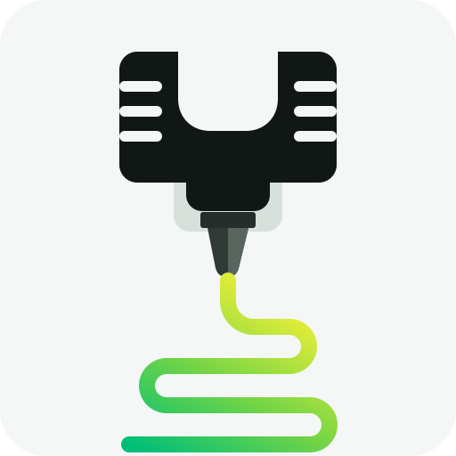

<p align="center">
  <picture>
    <source media="(prefers-color-scheme: dark)" srcset="assets/k2-3d-printing-logo-dark.svg">
    <source media="(prefers-color-scheme: light)" srcset="assets/k2-3d-printing-logo-light.svg">
    
  </picture>
</p>

# K2 3D Printing

`k2-3d-printing` is an installable Agent Skill for Creality K2-family printers, Creality Print, and FDM printing.

It helps an AI agent:

- choose filaments that match the printer, nozzle, build plate, enclosure, and CFS;
- inspect STL, STEP, 3MF, and G-code files;
- orient models and balance finish, speed, strength, material use, and support removal;
- navigate Creality Print, tune slicing settings, and review Preview;
- calibrate filaments, diagnose failed prints, and approach maintenance or repairs with verified procedures.
- remember multiple printers and their confirmed current setup in a portable, user-controlled JSON file.

Before recommending a setting, the skill checks the exact printer and the available sources. It tells you which values come from official documentation, which are manufacturer ranges, and which still need testing. A successful slice is not treated as proof that the print will succeed.

## Install

Use the [skills CLI](https://www.skills.sh/docs/cli):

```bash
npx skills add woliveiras/k2-3d-printing-skill
```

The skill is self-contained: no other skill, paid service, or printer connection is required. Optional tools require Python 3.10 or newer. Artifact inspectors are read-only. The printer-memory manager writes only an explicitly approved proposal to the user's per-account configuration directory; it does not modify the skill, a project, or a printer.

It does not edit projects, update software or firmware, control a printer, send a print, or buy parts without separate approval.

## Update

Installed skills are not updated automatically. Fetch the latest available version with:

```bash
npx skills update k2-3d-printing
```

Use `-g` to update a global installation or `-p` to update a project installation.

## Why it asks which K2 you own

The K2 family contains different machines with different hardware limits. If all you have is the name `K2C`, the skill will ask you to check the printer's physical label or `About` screen. It will not guess the hardware from a slicer profile.

## Portable printer memory

The skill can remember multiple printers by aliases such as `oficina` and `garagem`. It stores schema-versioned JSON outside the repository and outside any agent-specific installation. Local agents that can run Python and access the same file can reuse it; remote or isolated agents need an explicitly accessible copy.

Reading and proposing a change do not write. For a permanent component change, the skill waits for physical completion, shows the exact proposal, and asks separately before saving. Temporary changes remain conversation-only. Recent physical observation overrides stored memory.

## Explore

- [Skill instructions](skills/k2-3d-printing/SKILL.md)
- [Reference library](skills/k2-3d-printing/references/INDEX.md)
- [Portable printer memory](skills/k2-3d-printing/references/printer-memory.md)
- [Source register](skills/k2-3d-printing/references/sources.md)
- [Changelog](CHANGELOG.md)

## License

[MIT](LICENSE) © 2026 William Oliveira.
